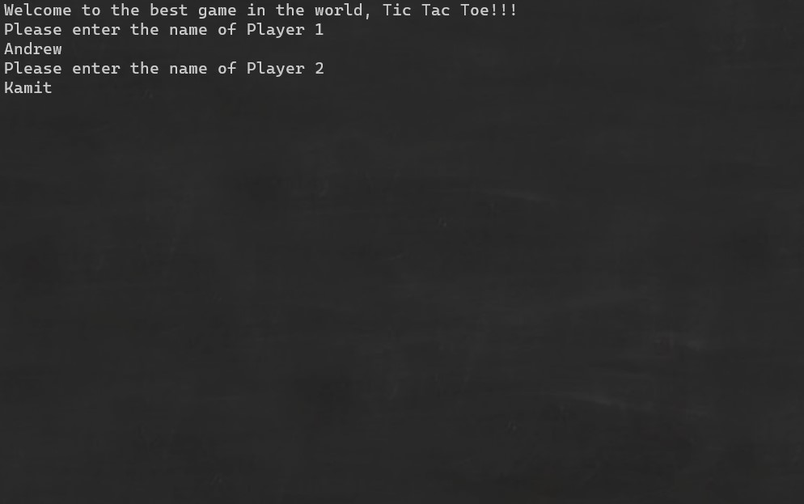

# Tic-Tac-Toe
---

Lab04-Classes & Objects
*Authors: Robert Carter, Andrew Smith, Kamit Satkeev*

---
## Description

This is a C# console application that will allow two users (on the same terminal) to play a game of tic-tac-toe. The users can pick a number 1-9 that corresponds with a placement on the 3 x 3 board. Once a user has 3 (X's) or 3 (O's) in a row, column, or diagonal line, they are declared the winner, and the app stops. 

---
## Getting started

Clone this repository to your local machine:
`$ git clone https://github.com/AndrewCS149/Lab04-Tic-Tac-Toe.git`

### To run this application from windows terminal:

Navigate to this folder:

`$ cd .\TicTacToe\TicTacToe\`

Then run:

`$  dotnet run .\Program.cs`

---
## Visuals

Choosing player names:

Gameplay:

Win:

---
## Change Log
1.5: Tests written
1.4: App has full functionality
1.3: TAs troubleshot technical problems with app execution - 9 July 2020
1.2: README completed - 9 July 2020
1.1: App first created - 9 July 2020
